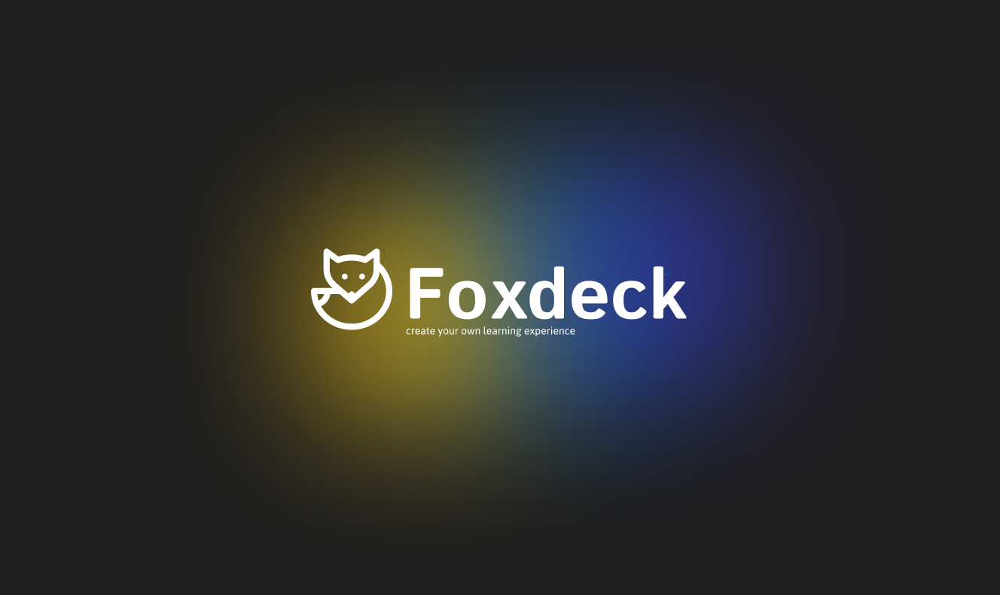
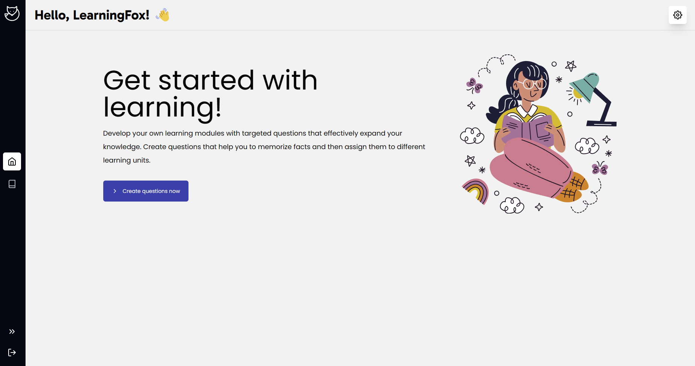
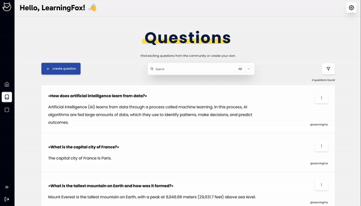

# Fox-Deck

Welcome to the future of learning with Foxdeck, a dynamic web application where flashcards meet community collaboration.
At Foxdeck, we've digitalized the tried-and-true method of learning with flashcards, adding a twist of interactivity and
user engagement. Here, not only can you create and manage your own digital flashcards, but you can also share them with
and learn from a vibrant community. Whether you're looking to master new concepts, prepare for exams, or simply expand
your knowledge, Foxdeck connects you with like-minded learners. Join our community and experience a new, collaborative
approach to learning, one question at a time.

> Please note that this project is currently in progress and may not yet be complete.

## ❓ Rediscovering Learning with Flashcards?

The beauty of flashcards lies in their simplicity: small, digestible bits of information that effortlessly imprint on
your memory. You'll notice a swift improvement in your ability to recall facts and understand concepts. Moreover, the
repetitive process of reviewing flashcards transforms your study time into an engaging and enjoyable game-like
experience, enhancing both the fun and efficacy of learning.

## 💫 Features

Foxdeck emphasizes the creation of personalized questions. This approach is rooted in the philosophy that learning is
most effective when it's tailored to the individual's style and needs. We are tying to make learning more engaging,
efficient, and deeply personalized.

### Empower your learning experience

Empower your learning experience with the ability to create custom questions on Foxdeck! This feature puts the control
in your hands, allowing you to tailor your study material to perfectly fit your learning needs. Whether you're tackling
complex theories, brushing up on language skills, or preparing for specific exams, crafting your own questions helps
reinforce understanding and retention. With a user-friendly interface, Foxdeck makes it simple and efficient to
personalize your learning journey. Start creating your questions today and study smarter, not harder.

### Share your questions with the community

Unlock the power of collective learning with Foxdeck's community-sharing feature! This platform isn't just about
personal learning; it's about growing together. Share your custom-made flashcards and tap into a wealth of knowledge
from fellow learners. Whether you're seeking input on tricky questions or offering insights into challenging topics, our
community is here to support and enrich your learning journey. Engage, interact, and discover new perspectives – all
while helping others on their path to knowledge.

## 🖥️ Get Involved in Development

We invite all developers to dive into Foxdeck's unassigned issues – your opportunity to make a significant impact. Start
your journey with us by exploring our[developer documentation](http://developer.foxdeck.de), a comprehensive guide to
the inner workings of Foxdeck.
If you're inspired to add your own unique features or improvements, feel free to open new issues. We're particularly
eager for fresh UX/UI ideas to enhance the Foxdeck experience. Join us in shaping the future of this innovative learning
tool!

To standardise commit messages, we use [conventional commits](https://www.conventionalcommits.org/en/v1.0.0/).
These commit messages are currently not supported by any kind of semantic release. Corresponding plugins are
available for the IDEs:

* **IntelliJ:** https://plugins.jetbrains.com/plugin/13389-conventional-commit
* **VSCode:** https://marketplace.visualstudio.com/items?itemName=vivaxy.vscode-conventional-commits

