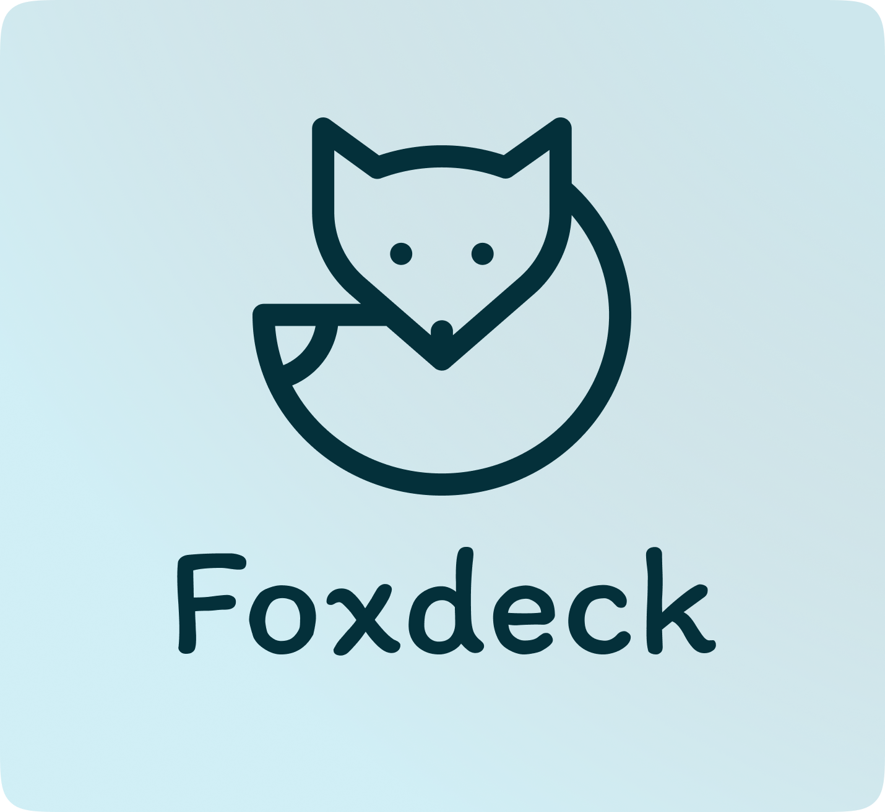

<h1 align="center">
    

 <!-- ALL-CONTRIBUTORS-BADGE:START - Do not remove or modify this section -->

<!-- ALL-CONTRIBUTORS-BADGE:END -->

</h1>

  <em><b>Foxdeck</b> is a dedicated note-taking application designed specifically to cater to the unique requirements of students.</em>

> [!important]  
> Please note that this project is currently in progress and may not yet be complete. Features will be added and 
> changed base on the feedback around foxdeck.

## 🎯 Features

* creating and organizing notes

## 🖥️ Get Involved in Development

We invite all developers to dive into Foxdeck's unassigned issues – your opportunity to make a significant impact. Start
your journey with us by exploring our [developer documentation](http://docs.foxdeck.de), a comprehensive guide to
the inner workings of Foxdeck.
If you're inspired to add your own unique features or improvements, feel free to open new issues. We're particularly
eager for fresh UX/UI ideas to enhance the Foxdeck experience. Join us in shaping the future of this innovative learning
tool!

To standardise commit messages, we use [conventional commits](https://www.conventionalcommits.org/en/v1.0.0/).
These commit messages are currently not supported by any kind of semantic release. Corresponding plugins are
available for the IDEs:

* **IntelliJ:** https://plugins.jetbrains.com/plugin/13389-conventional-commit
* **VSCode:** https://marketplace.visualstudio.com/items?itemName=vivaxy.vscode-conventional-commits

## ❤️ Contributors

<!-- ALL-CONTRIBUTORS-LIST:START - Do not remove or modify this section -->
<!-- prettier-ignore-start -->
<!-- markdownlint-disable -->
<table>
  <tbody>
    <tr>
      <td align="center" valign="top" width="14.28%"><a href="https://github.com/Eric-Schubert"> <b>Eric Schubert</b></a> <a href="#infra-Eric-Schubert" title="Infrastructure (Hosting, Build-Tools, etc)">🚇</a> <a href="https://github.com/Foxdeck/fox-deck/commits?author=Eric-Schubert" title="Code">💻</a></td>
    </tr>
  </tbody>
</table>

<!-- markdownlint-restore -->
<!-- prettier-ignore-end -->

<!-- ALL-CONTRIBUTORS-LIST:END -->
<!-- prettier-ignore-start -->
<!-- markdownlint-disable -->

<!-- markdownlint-restore -->
<!-- prettier-ignore-end -->

<!-- ALL-CONTRIBUTORS-LIST:END -->
