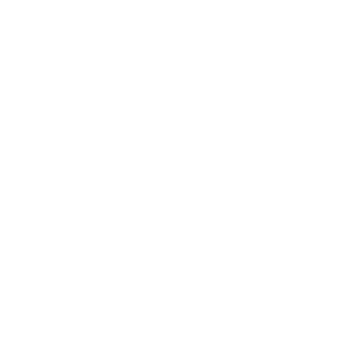

# Fox-Deck



Welcome to Fox Deck, a dynamic and interactive web application designed for creating and managing questionnaires. This
project leverages the power of Vue.js and Tailwind CSS for the frontend, and NestJS for the backend, offering a robust
and scalable solution for questionnaire management.

> This project is currently WIP and not finished yet.

## Features

- **Interactive Questionnaires**: Create and participate in engaging questionnaires.
- **Vue.js Frontend**: A modern and reactive user interface.
- **NestJS Backend**: Robust backend architecture for handling data and requests.
- **Tailwind CSS**: A utility-first CSS framework for rapid UI development.

## Getting Started

### Prerequisites

- Node.js
- npm or yarn

### Installation

1. Clone the repository:

```bash
$ git clone https://github.com/dominique-boerner/fox-deck.git
```

2. Install dependencies

```bash
$ npm run install:deps
```

3. Create Prisma Client

```bash
$ cd apps/fox-deck-api && npm run prisma:generate
```

4. Running the Application

```bash
$ npm run dev
```
