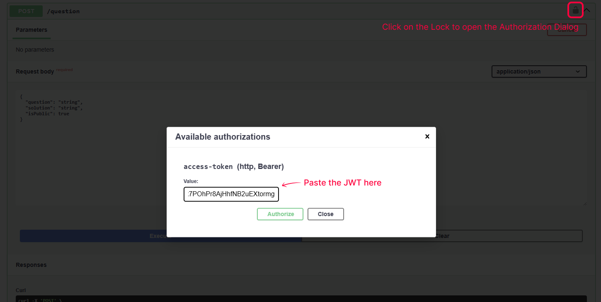
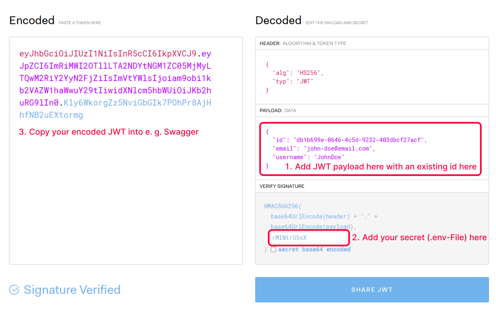

== Foxdeck - API

This document is intended to provide an insight into the structure of the Foxdeck API.
It is intended to be a first entry point for developers who want to implement new functionalities in the API or who want to get an in-depth overview.

=== Getting started

==== 1. Install dependencies

To install the back-end, navigate to the fox-deck-api directory and install the NPM dependencies with the following command:

[source,bash]
----
$ npm install
----

==== 2. Generate database

The API uses a SQLite database which must be initialized.
The location of the database is stored in the .env file in the fox-deck-api directory.
There is an .env.example file by default.
It is best to make a copy of it and rename this copy to ".env".

To create the database, execute the following command in the main directory of fox-deck-api:

[source,bash]
----
$ npm run prisma:migrate
----

This command creates the database in the directory stored in .env.

TIP: It makes sense to connect to the database via https://www.jetbrains.com/help/idea/database-tool-window.html[IntelliJ], for example, in order to be able to easily understand the contents of the database.

==== 3. Start the API

After the above steps have been carried out, the back-end can be started with the following command:

[source,bash]
----
$ npm run start:dev
----

Afterward the Swagger documentation can be accessed via http://localhost:3000/api in the browser.

=== Structure

The structure of the API follows the best practices of NestJS for modular applications.
The application is divided into different "modules", with each module defining a specific topic area. These modules can be found in the /src/modules-directory of the fox-deck-api.
The NestJS documentation is a good starting point for understanding how NestJS applications are structured.

Further information can be found at https://docs.nestjs.com/modules.

==== Controller

In NestJS, a framework for Node.js, a controller is a class that handles incoming requests.
Controllers are responsible for managing the flow of data between the server and the client.
They are defined with the @Controller() decorator, which maps specific routes to the corresponding controller actions.

Each method within a controller can handle requests for different routes and HTTP methods (GET, POST, etc.).
These methods are marked with decorators like @Get(), @Post(), @Put(), and so on, which specify the type of request they handle.

Controllers are a key part of NestJS's architecture.
In NestJS, while controllers handle incoming requests and responses, they ideally should not contain business logic.
The business logic is typically encapsulated in services or providers, which are separate classes marked with the @Injectable() decorator.

The role of a controller in NestJS is to:

1. *Receive incoming requests:* Controllers define routes and handle requests that come to those routes.
2. *Validate input:* Controllers can validate incoming data before passing it to services.
3. *Delegate work to services:* Controllers call services where the actual business logic is implemented.
4. *Return responses:* Controllers send back responses to the client, which might include data processed by the services or status messages.

Further information can be found at https://docs.nestjs.com/controllers

==== Service (Providers)

In NestJS, a service is a fundamental concept that refers to a class responsible for handling business logic and data access.
Services in NestJS are designed to be reusable and modular, allowing for a clear separation of concerns within the application.
Here are the key aspects of services in NestJS:

1. *Business Logic Container:* Services contain the core business logic of the application.
They perform operations like data processing, calculations, and decision-making based on application rules.
2. *Data Access:* Services often interact with databases or external APIs to fetch, create, update, or delete data.
3. *Injectable:* Services in NestJS are marked with the @Injectable() decorator.
This decorator allows NestJS to manage the service as a provider and enables dependency injection, making it easier to use services across different parts of the application.
4. *Modularity and Reusability:* By encapsulating business logic in services, the code becomes more modular and reusable.
It helps in keeping controllers slim and focused only on handling request and response.
5. *Integration with Modules:* Services are usually associated with modules.
A module in NestJS is a class annotated with the @Module() decorator, which organizes related components like controllers, services, and other providers.
6. *Testability:* Since services are isolated and focused on specific tasks, they are easier to test.
Unit testing can be effectively applied to services, ensuring that the business logic works as expected.

In summary, services in NestJS play a crucial role in handling the business logic of an application, promoting a clean, testable, and maintainable codebase.

Further information can be found at https://docs.nestjs.com/providers

==== Shared directory

The shared directory contains code that can be shared across different parts of the application. This approach helps in maintaining a clean and modular code structure. Here are some typical uses and examples:

1. *Common Services:* Services that are used by multiple modules, such as logging or validation services, can be placed in the shared directory.
2. *Utilities and Helpers:* Functions or classes that provide utility operations like data formatting, validation rules, or custom decorators.
3. *Constants and Configuration:* Shared constants, configuration settings, or environment-specific variables that are used across the application.
4. *Interfaces and DTOs (Data Transfer Objects):* Shared interfaces or DTOs for consistent type definitions and data validation across different parts of the application.
5.. *Common Middleware, Guards, and Interceptors:* Reusable middleware, guards, and interceptors that can be applied in various parts of the application.

By using a shared directory, developers can avoid duplicating code and ensure that common functionalities and utilities are centrally managed and easily accessible throughout the application. This enhances the maintainability and scalability of the codebase.

IMPORTANT: use the shared directory judiciously to avoid creating a catch-all location that becomes difficult to manage. The goal is to keep the shared directory well-organized and limited to truly reusable and application-wide concerns.

=== Security

An interceptor was implemented in NestJS to protect the endpoints of the API.
This interceptor checks every incoming connection to see whether extended authentication is required or not.

The form in which authentication is required or not depends on whether a route has a certain security level.
This is determined with an @Security-Decorator.

==== Usage of the @Security Annotation

The @Security annotation can be used to set which security level is required to call up the route.
There are currently two security levels:

* *NO_SECURE*: No security validation at all, the same as leaving the @Security-Decorator away.
* *JWT_VALID*: Validation of the JWT, which must be a valid JWT.

If the security level "JWT_VALID" has been selected, the JWT in the header is compared with the checksum.
If the JWT is valid, it is parsed and the "User" property is added to the request (see _AuthenticatedRequest_-interface).

===== Example

[source,typescript]
----
@ApiBearerAuth("access-token")
@Security(SecurityType.JWT_VALID)
@HttpCode(HttpStatus.CREATED)
@Post("question")
async createQuestion(
@Body() data: CreateQuestionRequestDto,
@Req() request: AuthenticatedRequest, // 1. get request object
): Promise<Question> {
try {
  const user = request.user; // 2. get user from request
  return this.questionService.createQuestion({
    ...data,
    authorId: user.id,
  });
} catch (e) {
  throw new InternalServerErrorException(e);
}
}
----

==== Usage of the @ApiBearerAuth Annotation

The@ApiBearerAuth("access-token") annotation is used to enable authentication in the Swagger documentation.
After the annotation has been installed, you will find a small lock at the top right of the screen in the Swagger documentation.
Clicking on it opens a dialog in which the authentication token can be entered:

===== Example

The annotation can be used in the code as follows:

[source,typescript]
----
@Controller('example')
export class ExampleController {
  @Get()
  @ApiBearerAuth("access-token")
  getData() {
    // ...
  }
}
----

==== Generate a JWT for Testing

To generate a JWT, you can use the official website https://jwt.io/:

IMPORTANT: Look into jwt-body.interface.ts to see the current payload the JWT contains.

=== E2E Testing

To run the E2E tests (*.e2e-spec.ts), you must first create the test database. To do this, execute the following command in the main directory of fox-deck-api:

[source,bash]
----
$ npm run prisma:e2e-migrate
----

If the last command was successful, there is a test.db in the "Prisma" directory.

==== Using the db in test

To use the database in E2E, it is initialized before each test. The current database is deleted and rewritten.

The "setupDatabase()" function was implemented for this purpose. This function returns the current PrismaClient. This can in turn be used to gain direct access to the database.

[source,typescript]
----
// 1. import setupDatabase from setup-test-db in prisma-directory
import {setupDatabase} from "../../../prisma/setup-test-db";

describe('QuestionController', () => {
  let app: INestApplication;
  let prisma: PrismaClient; // 2. create variable "prisma"

  beforeEach(async () => {

    const moduleFixture: TestingModule = await Test.createTestingModule({
      imports: [QuestionModule]
    }).compile();

    prisma = await setupDatabase(); // 3. assign "prisma"-variable to setupDatabase()
    app = moduleFixture.createNestApplication();
    await app.init();
  });

  // put your tests here...
}
----

Examples for orientation can be found in the question.controller.e2e-spec.ts.